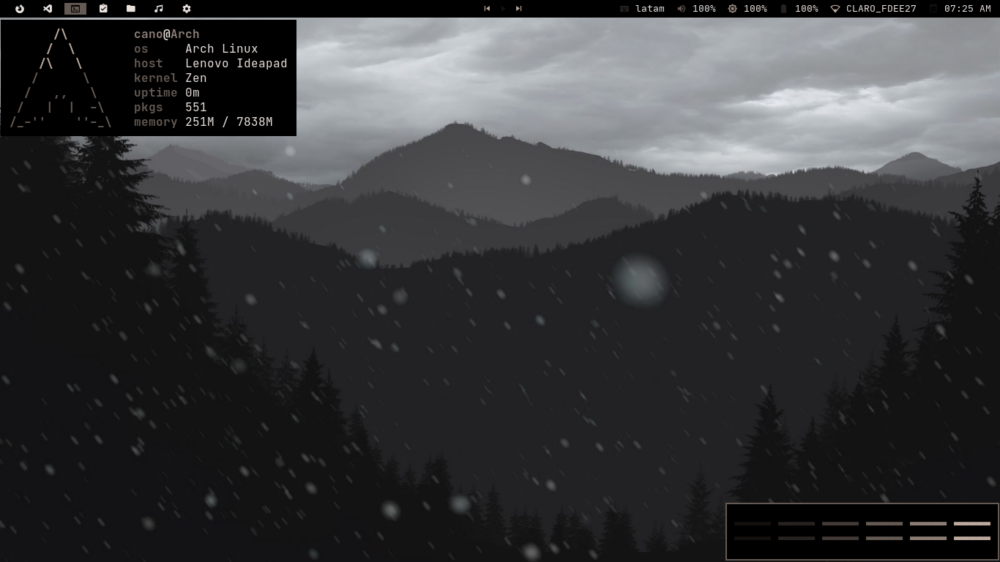
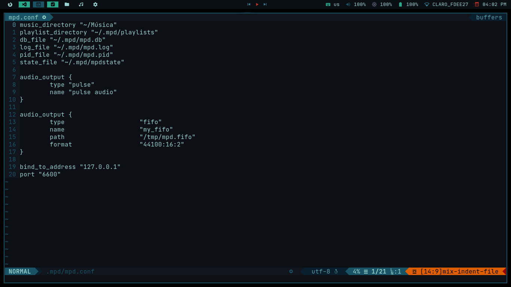
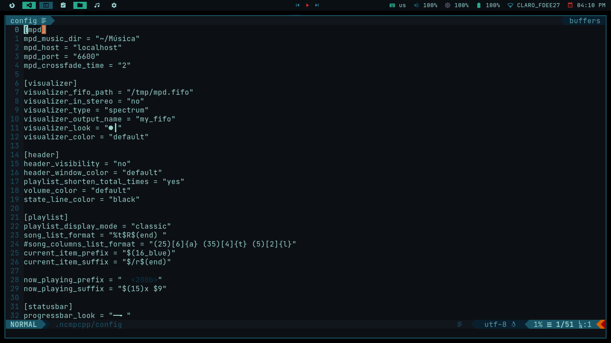

# Nota  
Utilice algunos script de la distro Archcraft cada archivo tiene contiene la mención al autor de ellos [adi1090x](https://github.com/adi1090x) 

# Dotfiles & Configuraciones   

Checa las combinaciones de [teclas](https://github.com/PAC97/dotfilesBlack#Teclas) y el  
[software](https://github.com/PAC97/dotfilesBlack#Software) utilizado en los dotfiles.  

## Menú
[Teclas](https://github.com/PAC97/dotfilesBlack#Teclas)   
[Software](https://github.com/PAC97/dotfilesBlack#Software)    
[Instalaciones](https://github.com/PAC97/dotfilesBlack#Instalaciones)  


## BSPWM
  

# Teclas  

## Ventanas

| Key                                           | Action                                   |
|-----------------------------------------------|------------------------------------------|
| **super + f**                                 | fullscreen                               |
| **super + p**                                 | pseudo tiled                             |
| **super + t**                                 | tiled                                    |
| **super + space**                             | alternate floating and tiled             |
| **super + {h,v,c}**                           | split horizontal,vertical,cancel         |
| **super + ctrl + {1-9}**                      | Preselect the ratio                      |
| **super + shift + {up,down,left,right}**      | move window up,down,left,right           |
| **alt + shift + tab**                         | Change focus to next window              |
| **ctrl + alt + {Left, Right}**                | Switch workspace                         |
| **super + {Tab,grave}**                       | Switch to last opened workspace          |
| **super + shift + {1,8}**                     | Send focused window to another workspace |
| **super + control + {Left,Right,Up,Down}**    | Expanding Floating Window                |
| **super + alt + {Left,Right,Up,Down}**        | Shrinking Floating Window                |
| **control + shift + {Left,Down,Up,Right}**    | Move floating windows                    |
| **sctrl + alt + {q,r}**                       | Quit/Restart bspwm                       |
| **super + w**                                 | Close App                                |
| **ctrl + alt + Escape**                       | Kill                                     |
| **super + Escape**                            | Reload Keybindings                       | 

## Apps

| Key                        | Action                        |
|----------------------------|-------------------------------|
| **super + d**              | Rofi Launcher                 |
| **super + shift + f**      | launch pcmanfm                |
| **super + shift + b**      | launch firefox                |
| **super + shift + g**      | launch geany                  |
| **super + shift + d**      | neovim                        |
| **super + shift + p**      | ncmpcpp + cava                |
| **super + return**         | kitty (terminal)              |
| **super + shift + return** | kitty (terminal) floating     |
| **super + shift + w**      | Rofi Open Windows             |
| **super + shift + m**      | Music Controller              |
| **super + shift + r**      | Root apps                     |
| **super + shift + x**      | Power Menu                    |
| **super + shift + n**      | Open/Close Notification Center|
| **ctrl + alt + s**         | Screenshot Menu               |
| **ctrl + alt + n**         | Network Menu                  |
| **ctrl + alt + t**         | Themes Menu                   |
| **ctrl + alt + l**         | LockScreen                    |
| **PrintSc**                | Take a screenshot             |
| **alt + PrintSc**          | Take a screenshot in 5 second |

# Software

| Software                      | Fonts                        |
|-------------------------------|------------------------------|
| **bspwm**                     | **JetBrains Mono**           |              
| **sxhkd**                     | **JetBrains Mono Hack Nerd** |              
| **rofi**                      | **Meterial Icons**           |              
| **polybar**                   | **Iosevka**                  |              
| **mpd**                       | **Feather**                  |
| **mpc**                       | **Siji**                     |              
| **ncmpcpp**                   | **Iosevka Nerd Font**        |              
| **ncmpcpp-ueberzug**          | **Waffle**                   |              
| **alsa-tools**                |                              |          
| **alsa-utils**                |                              |              
| **alsa-plugins**              |                              |              
| **pulseaudio**                |                              |              
| **pulseaudio-alsa**           |                              |              
| **scrot**                     |                              |        
| **viewnior**                  |                              |            
| **xorg-xbacklight**           |                              |              
| **deadd-notification-center** |                              |              
| **neovim**                    |                              |              
| **firefox**                   |                              |              
| **geany**                     |                              |              
| **ranger**                    |                              |
| **dunst**                     |                              |  
| **lxappearance**              |                              |
| **picom-tryone**              |                              |
| **networkmanager-dmenu**      |                              |  
| **networkmanager**            |                              |
| **wpa_supplicant**            |                              |    
| **dialog**                    |                              |
| **nm-connection-editor**      |                              |  
| **arc-gtk-theme**             |                              |    
| **papirus-icon-theme**        |                              | 

# Instalaciones  
```
sudo pacman -S bspwm sxhkd rofi mpd mpc ncmpcpp alsa-tools alsa-utils alsa-plugins pulseaudio pulseaudio-alsa scrot\
 viewnior xorg-xbacklight neovim firefox geany ranger dunst lxappearance networkmanager wpa_supplicant dialog\
 nm-connection-editor arc-gtk-theme papirus-icon-theme feh ffmpeg ffmpegthumbnailer imagemagick xfce4-power-manager kitty
```
```
git clone https://aur.archlinux.org/polybar.git  
cd polybar  
makepkg -si 
``` 
```
yay -S picom-tryone-git networkmanager-dmenu-git deadd-notification-center-bin betterlockscreen-git kunst-git 
```  
## Deadd Notification Center (Dependencias) 
```
pip install notify-send.py
```

## ncmpcpp-ueberzug (Dependencias) 
Instalar [ueberzug](https://github.com/seebye/ueberzug). Debes tener pip:

```
$ sudo pip3 install ueberzug
``` 

## Instalar Dotfiles 
``` 
git clone https://github.com/PAC97/dotfiles.git  
cd dotfiles  
cp -r .config/* ~/.config  
sudo cp -r fonts/* /usr/share/fonts   
sudo cp bin/* /usr/local/bin  
cp -r .Xresources.d ~/  
cp .Xresources ~/  
cp .fehbg ~/  
cp -r .mpd ~/  
cp -r .ncmpcpp ~/  
```  

## Configurar mpd   
```
cd ~/.mpd  
touch mpd.db mpd.log mpd.pid mpdstate  
mkdir playlists
nano ~/.mpd/mpd.conf  
En music_directory agregas el path de tu carpeta de Música  
```  
  

## Configurar ncmpcpp-ueberzug  
```
nano ~/.ncmpcpp/config  
En mpd_music_dir agregas el path de tu carpeta de Música  
nano ~/.ncmpcpp/ncmpcpp-ueberzug/ncmpcpp_cover_art.sh  
En music_library agregas el path de tu carpeta de Música  
```

  
